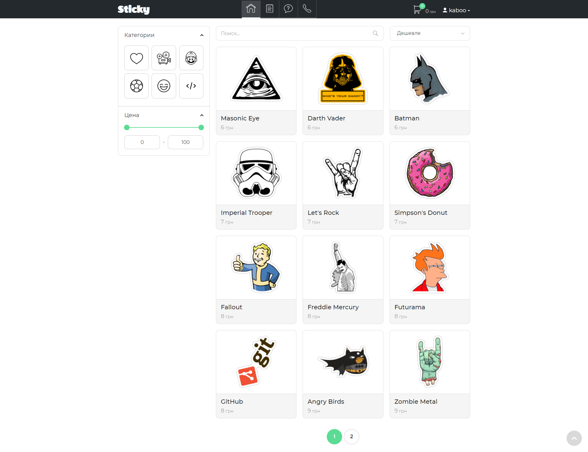
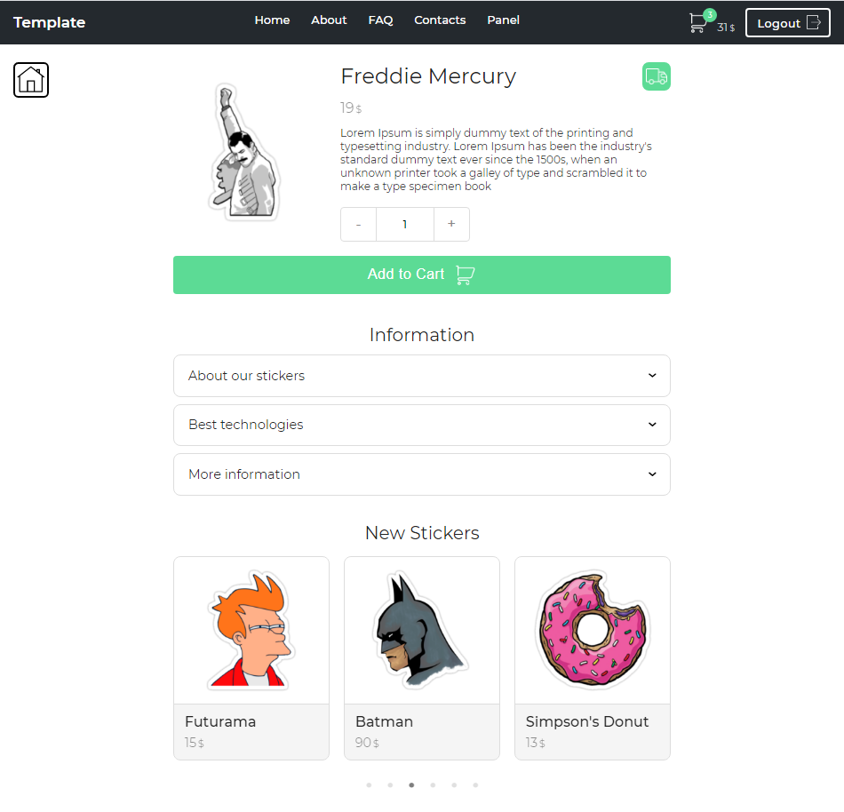
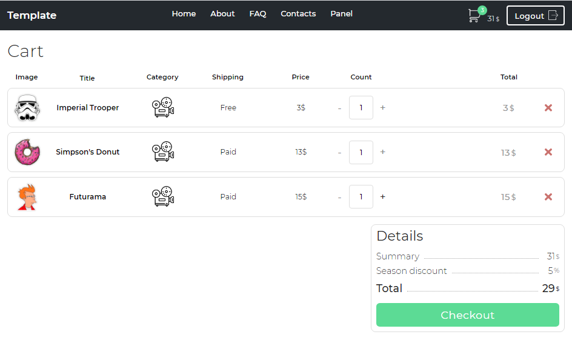
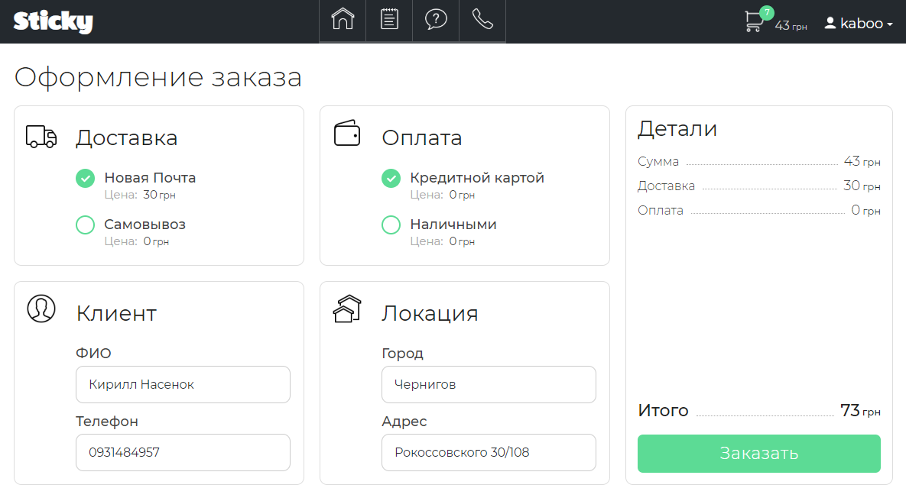
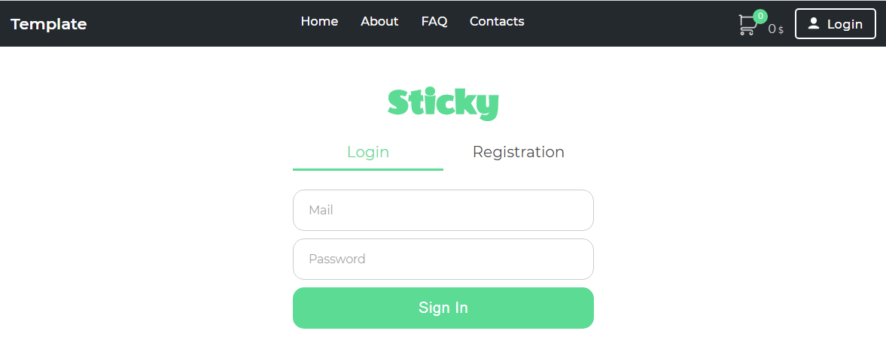
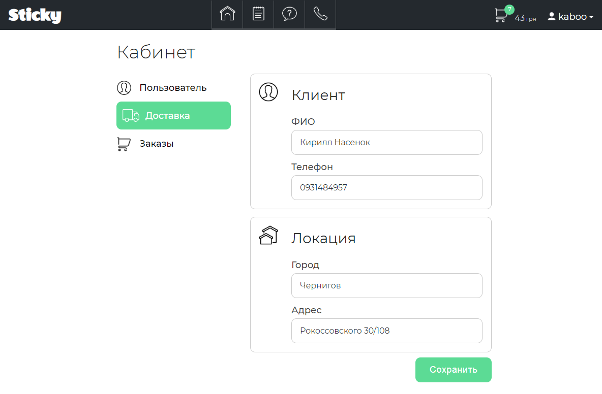
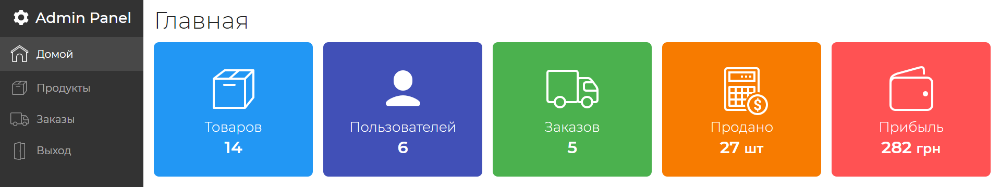
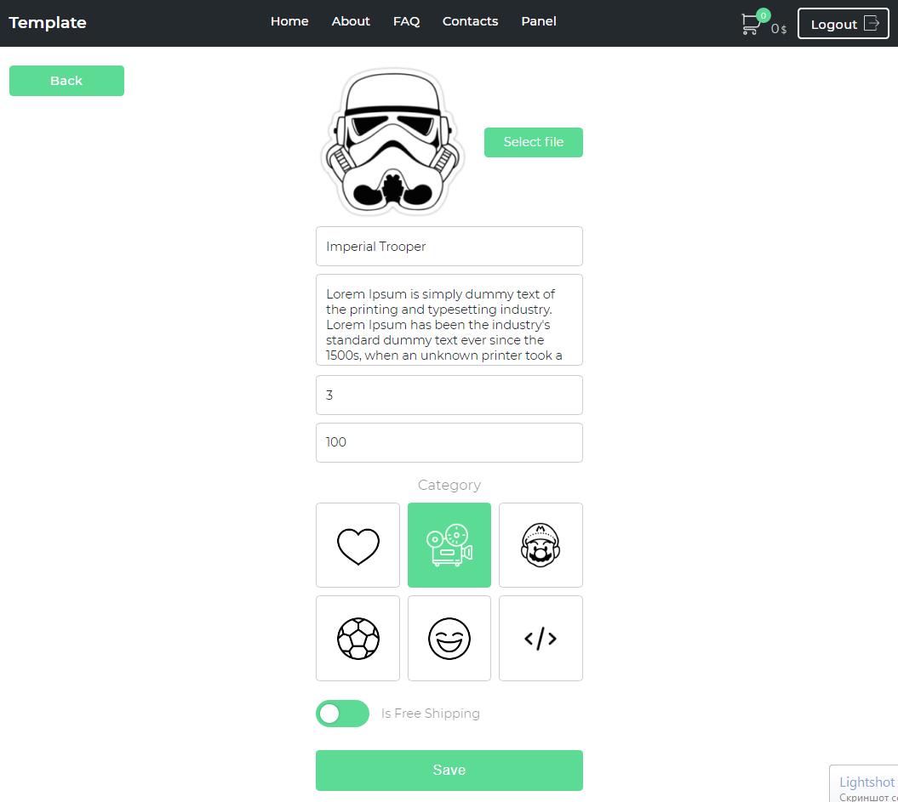
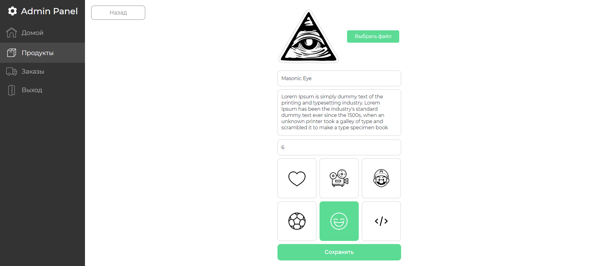

    

<h1 align="center">MERN stack online-shop</h1>

[![Forks][forks-shield]][forks-url]
[![Issues][issues-shield]][issues-url]
[![MIT License][license-shield]][license-url]

### What is this?
+ My first big MERN-stack project
+ Online-shop of stickers
+ Portfolio project

### How To Use
+ Clone this repo to your computer
+ "npm install" to install necessary modules
+ "npm run dev" to run front-end and back-end(on port 3000 and 5000)

### Project demo [Here](https://kaboo-shop-test.herokuapp.com)

 

 

 

 

 

 

 

 

 

<h3>Contact Me:</h3>

    
<b>Telegram:</b> @kaboo_bear 

    
<b>Gmail:</b> kaboo.bear@gmail.com 

    
<b>GitHub:</b> https://kaboo-shop-test.herokuapp.com/

[forks-shield]: https://img.shields.io/github/forks/kaboobear/E-commerce?style=flat-square
[forks-url]: https://github.com/kaboobear/E-commerce/network/members
[issues-shield]: https://img.shields.io/github/issues/kaboobear/E-commerce.svg?style=flat-square
[issues-url]: https://github.com/kaboobear/E-commerce/issues
[license-shield]: https://img.shields.io/github/license/kaboobear/E-commerce.svg?style=flat-square
[license-url]: https://github.com/kaboobear/E-commerce/blob/master/LICENSE.txt
