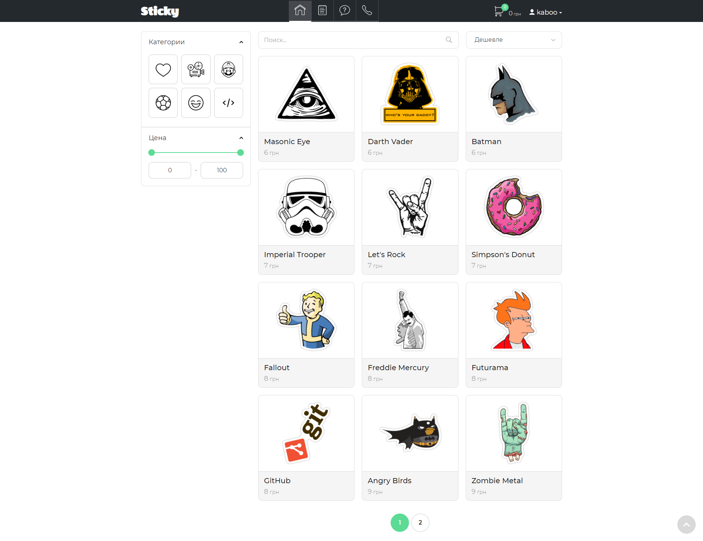
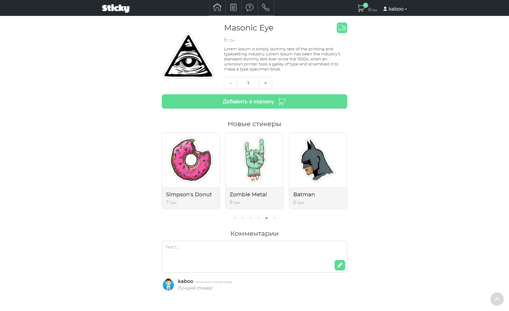
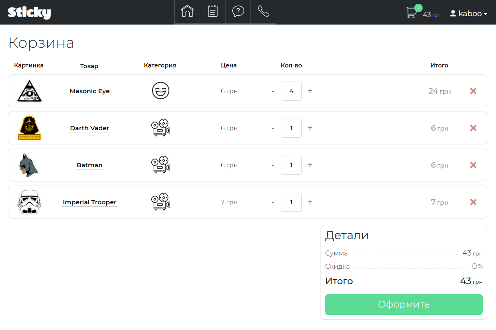
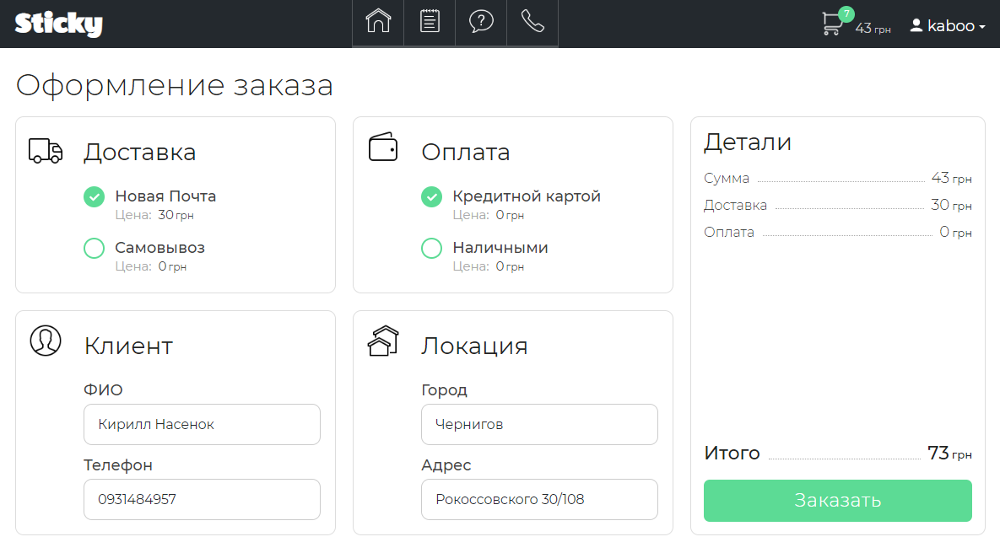
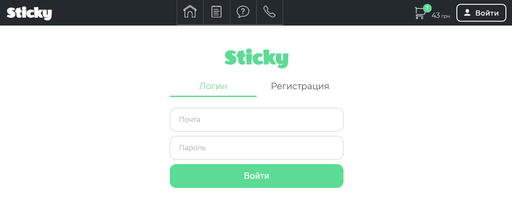
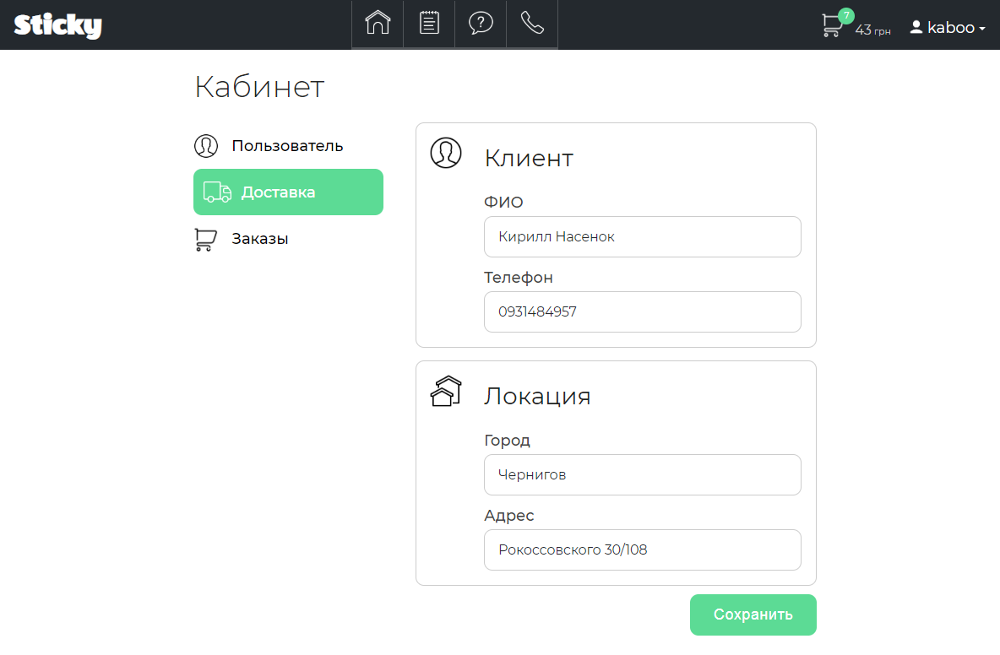
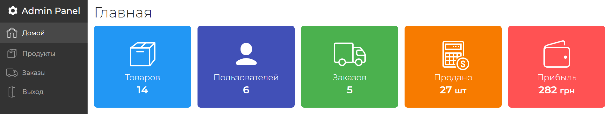
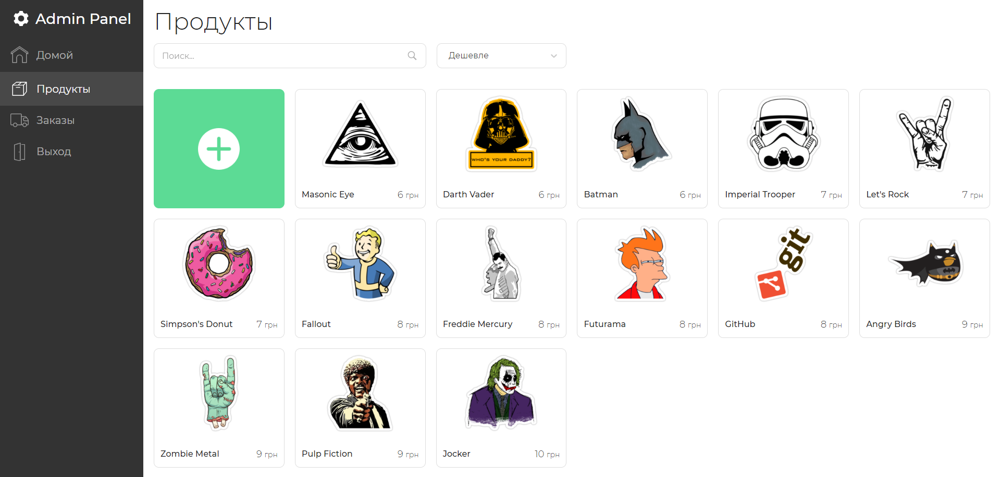
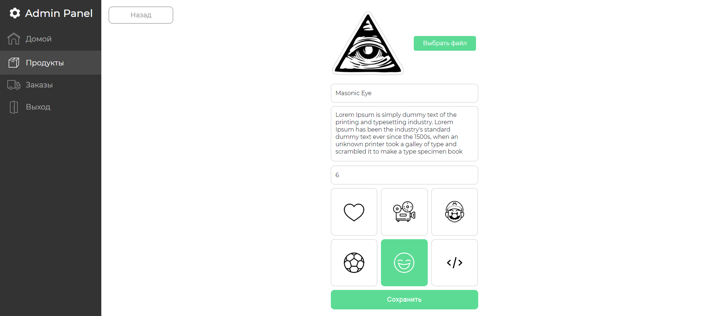

<h1 align="center">E-commerce project</h1>

### How To Use

- Clone this repo on your device
- `npm install` into 'root' and 'client'
- `npm run server` and `npm run client`

### Screenshots

 

 

 

 

 

 

 

 

